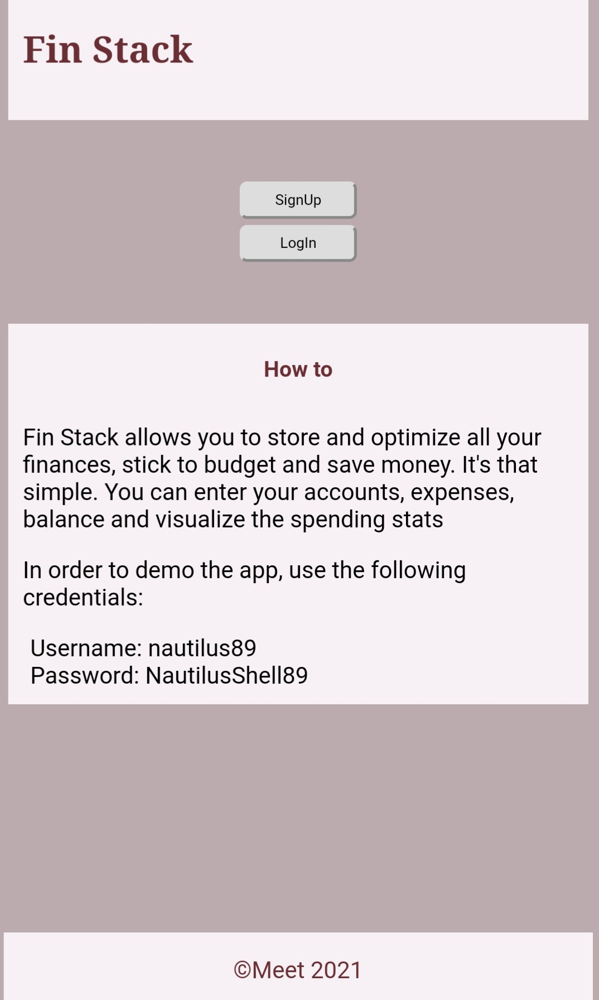

# Fin-Stack (Client)
App Live at https://fin-stack-client.vercel.app
### Table of Contents
- [Description](#description)
- [Tech stack](#tech-stack)

## Description

Fin-Stack allows you to store and optimize all your finances, stick to budget and save money. It's that simple. You can register, log-in, enter your accounts, expenses, balance and visualize the spending stats.
You can demo the app using the following credentials:

- Username: nautilus89 
- Password: NautilusShell89

## Tech stack

### FrontEnd

- JS/ES6
- React
- React-router
- CSS3
- HTML5

### BackEnd
- NodeJS
- Express
- Knex
- CORS
- Chai, Mocha, supertest (testing)

### Database
- PostgreSQL
